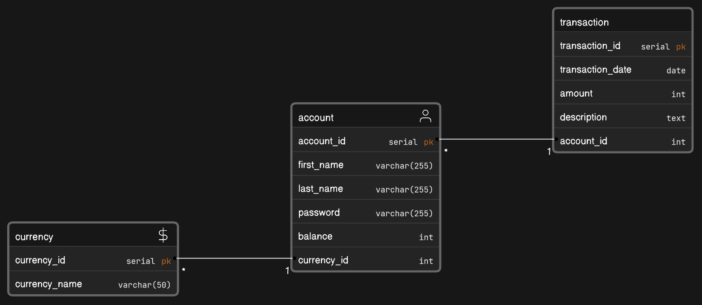

# WALLET BY HEI - PROG3

This Java API allows the management of accounts, transactions, and currencies for a financial tracking application
similar to Wallet by BudgetBakers

## Table of content

- [Introduction](#introduction)
- [Features](#features)
- [Configuration](#configuration)
- [Endpoints](#endpoints)
- [Contributions](#contributions)

## Introduction

This project consists of a Java API for managing accounts, transactions, and currencies for a financial management
application. It uses Java for the backend, a PostgreSQL database to store the data, and exposes endpoints to interact
with this data



## Features

- Creation, retrieval, updating accounts
- Addition, retrieval and management of transactions associated with accounts
- Currency management: addition, conversion, etc ..

### Code quality

Just run `./format.sh` and your whole code will be formatted using Google Java Format. To quote the GJF team: "There is no configurability as to the formatter's algorithm for formatting. This is a deliberate design decision to unify our code formatting on a single format."

## Configuration

To use this API locally, follow these steps:

1. Clone this repository

```bash
    git clone https://github.com/HarenaFiantso/WalletByHEI--PROG3.git
```

2. Ensure you have installed Java JDK and PostgreSQL database server
3. Configure the database details
4. Compile and launch the application

## Endpoints

- `/accounts`:
  - `GET`: Retrieve the list of accounts
  - `POST`: Create a new account
  - `PUT`: Update account details
- `/transactions`:
  - `GET`: Retrieve transactions for a specific account
  - `POST`: Add a new transaction to an account
  - `PUT`: Update transactions details
- `/currencies`:
  - `GET`: Retrieve the list of available currencies
  - `POST`: Add a new currency
  - `PUT`: Update exchange rates

### Petstore link:

https://petstore.swagger.io/?url=https://raw.githubusercontent.com/HarenaFiantso/WalletByHEI--PROG3/master/docs/api.yml

#### Andy Avotiana (STD22089) & Fiantso Harena(STD22086) - 2023
